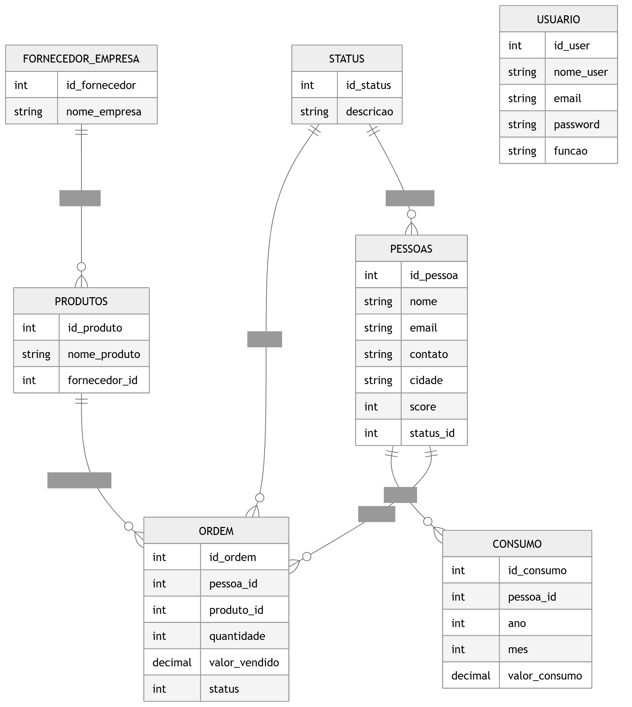
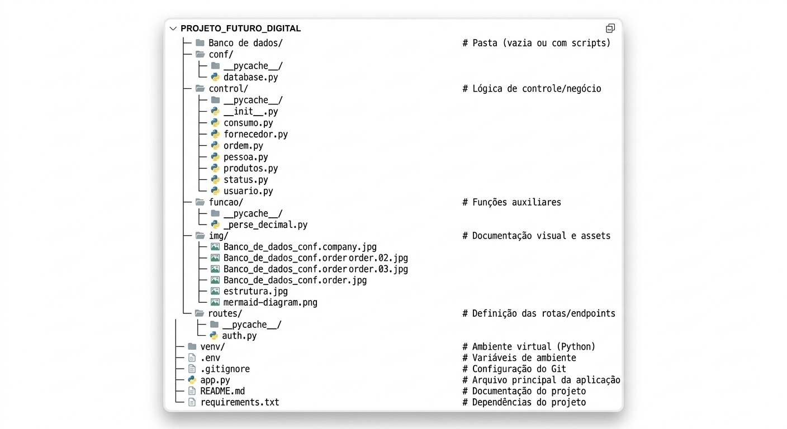
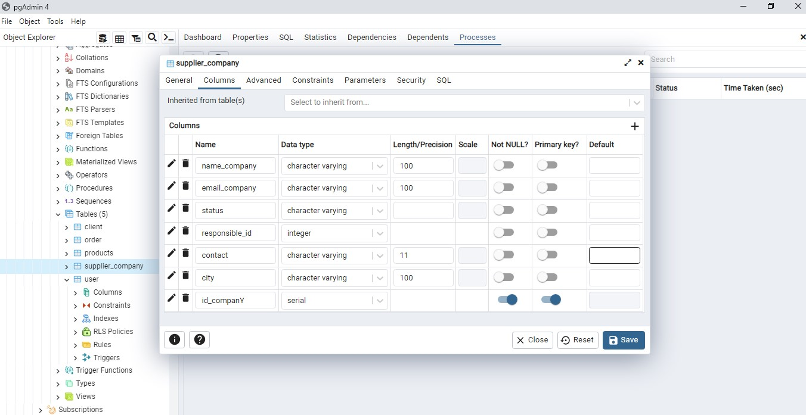
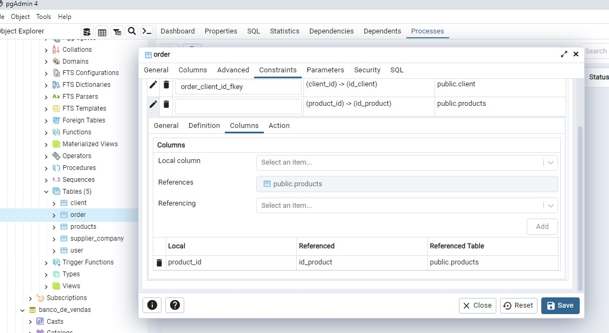
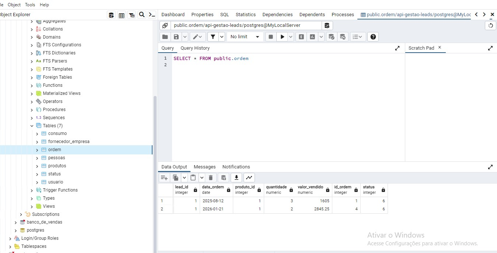
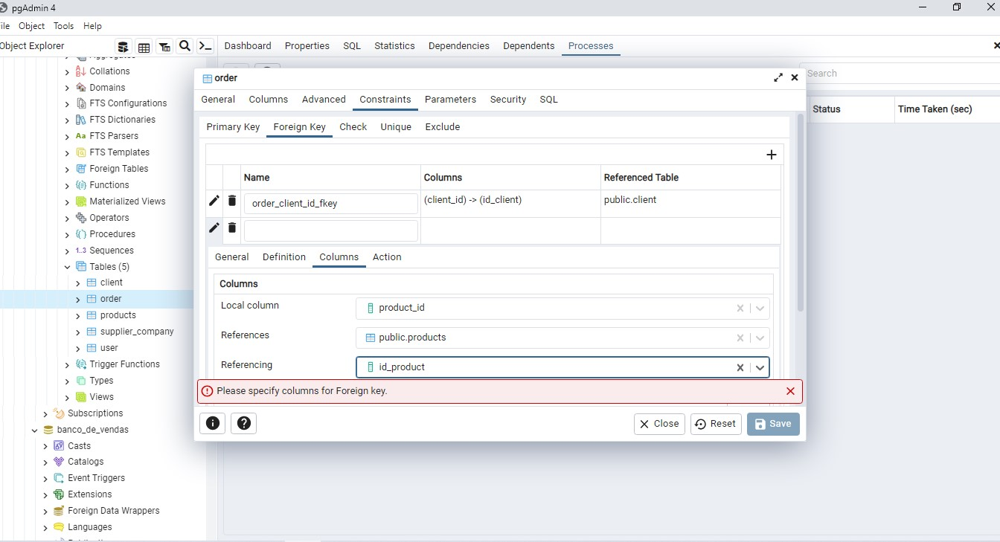

# 🚀 Projeto Futuro Digital

---

# 📌 Sobre o Projeto

O **Projeto Futuro Digital** é uma **API REST desenvolvida em Python**, voltada para gerenciamento de dados comerciais como clientes, fornecedores, produtos, consumo energético e ordens de venda.

O sistema foi desenvolvido utilizando **Flask e SQLAlchemy**, permitindo uma arquitetura modular, escalável e adequada para aplicações web modernas.

O projeto utiliza um **banco de dados remoto hospedado na plataforma Render**, garantindo acesso remoto e maior profissionalismo no gerenciamento das informações.

---

# 🎥 Demonstração da API

A demonstração acima mostra o funcionamento da API realizando operações de cadastro e consulta de dados.

---

# 🎯 Objetivo do Projeto

O sistema tem como objetivo fornecer uma estrutura organizada para gerenciamento de dados comerciais permitindo:

- cadastro de clientes e fornecedores
- registro de consumo energético
- gerenciamento de produtos
- controle de vendas
- classificação automática de clientes

---

# 🧠 Funcionalidades

## 👤 Gestão de Usuários

- cadastro de usuários
- atualização de informações
- consulta de registros
- exclusão de usuários

---

## 👥 Gestão de Pessoas

- cadastro de clientes e leads
- validação de e-mail e telefone
- cálculo automático de score
- classificação automática de status

---

## 📊 Gestão de Consumo

- registro de consumo energético
- atualização automática de registros (UPSERT)
- associação com clientes

---

## 📦 Gestão de Produtos

- cadastro de produtos
- associação com fornecedores

---

## 🧾 Gestão de Ordens

- registro de vendas
- associação entre clientes e produtos
- controle de status

---

# 🗄️ Evolução do Banco de Dados

## Estrutura Inicial

- fornecedor_empresa
- ordem
- leads
- produtos
- status
- usuario

---

## Estrutura Final

Após ajustes solicitados pelos **stakeholders**, a estrutura passou a ser:

- consumo
- fornecedor_empresa
- ordem
- pessoas
- produtos
- status
- usuario

Essas mudanças trouxeram maior aderência às necessidades do cliente final.

---

# 📊 Diagrama do Banco

## 📂 Estrutura do Projeto

## 📷 Desenvolvimento do Banco

As imagens abaixo mostram etapas da configuração da tabela ordem durante o desenvolvimento do projeto.

# 🔐 Validações Implementadas

## Validações de Entrada

* campos obrigatórios
* formato de e-mail
* validação de números
* validação de datas

## Validações de Integridade

* verificação de registros relacionados
* controle de duplicidade
* validação de valores positivos

# 📡 Endpoints

## Usuário

POST /usuario/insert

GET /usuario/all

GET /usuario/{id}

PUT /usuario/{id}

DELETE /usuario/{id}

## Pessoa

POST /pessoa/insert

GET /pessoa/all

GET /pessoa/{id}

PUT /pessoa/{id}

DELETE /pessoa/{id}

## Ordem

POST /ordem/insert

GET /ordem/all

GET /ordem/{id}

PUT /ordem/{id}

DELETE /ordem/{id}

## Consumo

POST /consumo/insert

GET /consumo/all

GET /consumo/{id}

DELETE /consumo/{id}

# ⚙️ Tecnologias Utilizadas
## Linguagens
* Python
* SQL

## Framework
* Flask

## Banco de Dados
* PostgreSQL

## Infraestrutura
* Banco remoto hospedado no Render

# ▶️ Instalação
Clonar repositório
git clone https://github.com/WilliansNantes/Projeto_Futuro_Digital

# Entrar na pasta
cd Projeto_Futuro_Digital

# Criar ambiente virtual
python -m venv venv

# Ativar ambiente virtual
## Windows
venv\Scripts\activate

## Linux / Mac
source venv/bin/activate

# Instalar dependências
pip install flask flask_sqlalchemy psycopg2

# Criar banco de dados
Importar o arquivo
banco de dados.sql
no PostgreSQL.

# Executar aplicação
python app.py

## ✍️ Autor

**Willians Nantes**

## 🎓 Formação

- Automação Industrial

- Análise e Desenvolvimento de Sistemas

## 💻 Tecnologias

- Python
- C#
- Java
- C++
- JavaScript
- SQL
- APIs REST

## ⭐ Projeto desenvolvido para fins acadêmicos e portfólio profissional

